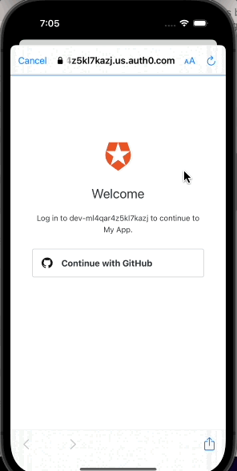

# Weather Application
 

  
  

    The application will get the weather forecast for the next 5 hours
  

## Features

- [x] Login using Github account
- [x] Input the city to get the weather forcast

## Requirements

- iOS 16.0+
- Xcode 14.2

## Meta

JayR Atamosa – atamosajr@yahoo.com

Distributed under the XYZ license. See ``LICENSE`` for more information.

